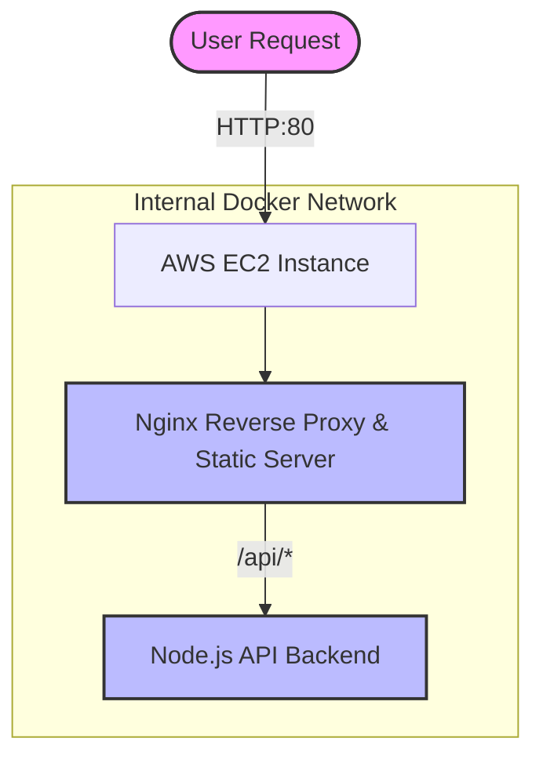

# Klin Scent Database - DevOps MVP

production-structured, infrastructure-aware full-stack web application designed for deployment to AWS EC2 using Docker and modern CI/CD practices. This project serves as a showcase of cloud-native deployment patterns, network isolation, and reverse proxying for a DevOps portfolio.

---

## 🏗️ Architecture Diagram



## 🔄 Request Flow Explanation

The application architecture enforces strict boundaries between public internet traffic and internal application services:

1. **Client Request**: A user visits the public EC2 IP/domain on port `80`.
2. **Nginx Reception**: Only the Nginx container is exposed to port `80` on the host. It receives all incoming traffic.
3. **Path-Based Routing**:
   - If the path is `/` (or anything not starting with `/api/`), Nginx serves statically compiled React files natively from its `/usr/share/nginx/html` directory.
   - If the path starts with `/api/`, Nginx acts as a **Reverse Proxy**. It forwards the request linearly to the internal `backend` Node.js container over the isolated Docker bridge network.
4. **Backend Processing**: The Express API processes the request, applying `NODE_ENV=production` optimizations, retrieving mock JSON data, and returning the response via Nginx back to the user.

---

## 🔒 Security Awareness

Security by design is integrated deeply into this architecture:

- **Single Point of Entry (Attack Surface Reduction)**: The `docker-compose.yml` ONLY exposes port `80` on the `nginx` container.
- **Internal Backend Isolation**: The Node.js `backend` container does not publish its port (`3000`). It is entirely unreachable from the public internet. It can only be communicated with via the internal Docker `klin-network`. This protects the API layer from direct external exploitation.
- **Minimal Image Footprint**:
  - The frontend uses a Multi-Stage Dockerfile. Compilers, node modules, and source code are discarded. Only static optimized files and Nginx binaries exist in the final minimal Alpine image.
  - The backend uses an `alpine` lightweight base and strict production installation limits.
- **Future HTTPS Growth**: By routing everything through Nginx, implementing SSL/TLS termination in the future requires merely attaching Certbot/Let's Encrypt to the Nginx container, leaving internal services untouched.

---

## 🚀 CI/CD Flow (GitHub Actions)

An automated deployment pipeline is configured in `.github/workflows/deploy.yml`.

1. **Commit & Push**: Developer pushes code to the `main` branch.
2. **Build Stage**: GitHub Actions checks out the code, securely logs into the GitHub Container Registry (GHCR), and builds both the `nginx` (frontend) and `backend` images.
3. **Tag & Push**: Images are tagged with the specific Git commit SHA (e.g., `ghcr.io/user/repo-nginx:1ab2c3d`) ensuring precise version immutability and rollback capability.
4. **Deploy Stage**: The Action connects securely to the AWS EC2 instance via SSH and injects the new image tags as environment variables.
5. **Zero-Touch Rollout**: It executes `docker compose pull` and `docker compose up -d`, seamlessly rotating the containers with the latest code. Finally, `docker image prune` cleans up old artifacts automatically.

---

## 🛡️ Failure & Recovery Plan

This infrastructure anticipates failure loops. Implementations include:

- **Docker Restart Policies**: Both containers enforce `restart: always`. In case of a Node exception or memory leak causing a crash, the Docker daemon will instantly resurrect the service.
- **Docker Healthchecks**: The backend provides a `/health` endpoint. `docker-compose.yml` binds to this with `wget` probes every 30 seconds. If the backend deadlocks or stops serving requests despite the container "running", the health status will flag it, triggering dependency restarts.
- **Rollback Procedure**: Because images are tagged to commit SHAs in GHCR, recovering from a bad deployment simply requires checking out the last stable commit and triggering the Action, or manually running `export NGINX_IMAGE=... && docker compose up -d` on the server with an older tag.

---

## ☸️ Future Kubernetes Migration

While currently utilizing Docker Compose, the architecture perfectly mimics Kubernetes constructs to ensure future migration is trivial:

| Current Compose Component | Kubernetes Equivalent              |
| ------------------------- | ---------------------------------- |
| `backend` container       | `Deployment` (Backend)             |
| internal `klin-network`   | `Service (ClusterIP)`              |
| `nginx` proxy config      | `Ingress` Controller / NodePort    |
| `.env` variables          | `ConfigMap` / `Secret`             |
| `/health` endpoint        | `livenessProbe` / `readinessProbe` |

Because no service expects direct host access, transforming this into a `Deployment` + `ClusterIP` structure requires zero code changes to the application logic.

---

## 🛠️ Local Development & Running

### Prerequisites

- Docker Engine
- Docker Compose v2

### Quick Start

1. Clone the repository natively or download it.
2. Copy the environment configuration:
   ```bash
   cp .env.example .env
   ```
3. Boot the environment in detached mode:
   ```bash
   docker compose up -d --build
   ```
4. Verify deployment:
   - Frontend reachable at: `http://localhost:80`
   - Backend API reachable internally, test via: `http://localhost:80/api/perfumes`
   - Container Healthchecks: `docker ps` to verify `(healthy)` status on backend.
